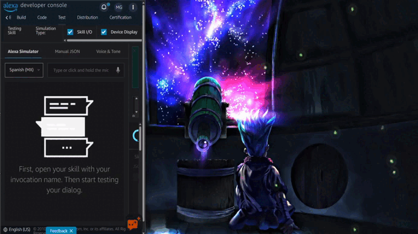

# Alexa PC Voice Control

## Demo

Demo using the Alexa Developer Console as reference:

## Description

**Alexa PC Voice Control** is an Alexa Skill that allows you to execute actions on your personal computer using voice commands through Alexa.

This system connects:

- An Alexa Skill (cloud side)
- A client application installed on your PC
- A secure tunnel using Cloudflare

The goal is to simplify everyday interactions with your computer, enabling hands-free control for tasks like launching applications, controlling media, and more.

## Requirements

Before installing the application, make sure you have the following:

### 1. Cloudflare Account

- You must have a Cloudflare account. If you don’t have one, create it for free.

### 2. Domain Name

- You need to own a Domain Name.

  - If you don't have one, you can purchase one through:

    `Cloudflare Dashboard > Domains > Overview > Buy Domain`

  - **Recommendations:**

    - Choose a domain with a very low initial cost (and renewal price)
    - Check renewal pricing (some domains are cheap at first but expensive later)

## Installation

### 1. Install the Alexa Skill

- Go to the Alexa Skills Store
- Search for **"Control my PC"**
- Install the skill

### 2. Download the Client Application

- Download the `AlexaPcVoiceControl.zip` file from this repository

### 3. Prepare Cloudflare

- Make sure you are logged into your Cloudflare account in your default browser
- Ensure it is the same account where your domain is registered

### 4. Run the Installer

- Extract the `AlexaPcVoiceControl.zip` file
- Run `AlexaPcVoiceControlSetup.exe`

### 5. Client Setup Process

  - During installation:

    - You will be asked to enter your domain
    - This domain will be linked to your PC

  - After setup completes:

    - Save your activation code
    - The activation code expires after 5 minutes
    - If the code expires, reinstall the client to generate a new one
    - The application will start automatically
    - The application will run in the Windows system tray under the name `AlexaPcVoiceControl`

### 6. Skill Setup Process

- Enable the Skill by saying:

  > "Alexa, escritorio remoto"

- Start the configuration process by saying:

  > "Configura mi PC"

- Link your device by saying:

  > "Mi código es ######"

(Replace `######` with the activation code shown after installation.)

## User Guide

A detailed user guide is included inside the `AlexaPcVoiceControl.zip` file.

  - It contains:

    - How to configure the Alexa Skill
    - How to use voice commands
    - Example interactions

## Technologies Used

- Python
- FastAPI (backend API)
- MPV (media player)
- yt-dlp (media streaming/downloading)
- Cloudflare Tunnel (secure remote access)

### Alexa Cloud Stack:

- Alexa Developer Console
- AWS Lambda
- Amazon DynamoDB
- Amazon API Gateway

## Security

The system includes multiple layers of security:

- API Key validation
- Device Secret authentication
- HMAC request signing
- Timestamp validation (prevents replay attacks)
- Secure HTTPS communication via Cloudflare Tunnel

## Additional Notes

- The application runs silently in the background
- It starts automatically with Windows (If enabled during the Client installation)
- No port forwarding is required

## Author

- [@Maiker260](https://github.com/Maiker260)
